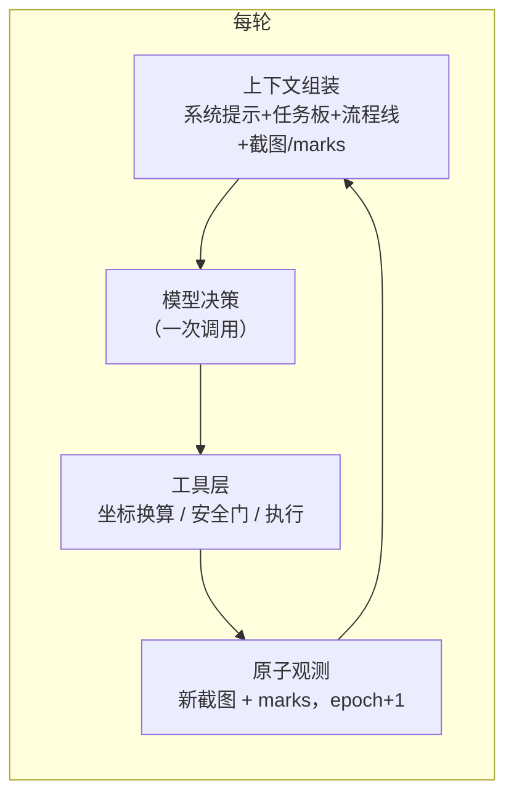
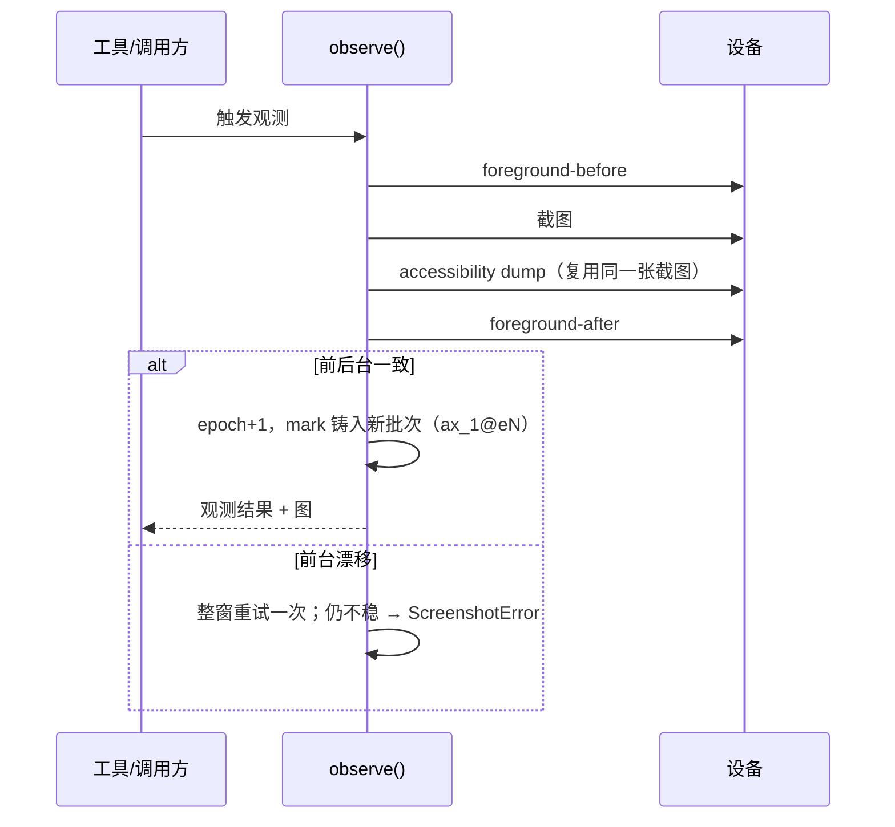

# 架构

## 主循环

每个决策周期一次模型调用、一个工具动作、一次新观测：



harness 不做流程编排：没有节点、没有路由，任务规划由模型通过 TaskDoc 任务板自行维护。

## 原子观测

观测由唯一生产者 `session.observe()` 完成，一个采样窗口内取齐四类信号；窗口内前台组件变化则整窗重试一次，再不稳则本次观测失败：



每次成功观测使上一批 mark 全部过期；执行动作引用过期 mark 时在 `resolve_mark` 处拒绝。这保证模型操作的永远是最新一帧。

## 窗口化 marks

屏幕默认按窗口分组呈现（`uiautomator dump --windows`，设备不支持自动回退单根模式）：

```
W1 TYPE_SYSTEM com.android.permissioncontroller layer=42 active focus
  ax_1@e12 | Button | 仅本次允许 | (500,522) | op=confirmed | path=dialog
W2 TYPE_APPLICATION com.tencent.mm layer=10 covered_by=W1
  ax_3@e12 | ImageButton | 返回 | (58,35) | op=blocked | path=toolbar
```

- 可操作性四档：confirmed（真窗口证据+未被覆盖）/ likely（默认）/ blocked（仅真 layer 证据：被高层弹窗覆盖）/ unknown；blocked 只展示不拦截；
- 名额按窗口配额分配，顶层弹窗有保底；
- 寻址语义不变：执行动作仍只认当前批次的 `ax_*@eN`；
- dump 失败（超时/解析错）触发一次重试，最终失败在观测文本显式标注，不装成“本屏无控件”。

## App 名解析

`launch_app("哔哩哔哩")` 的名字→包名解析分四层：归一化 → 多路候选生成（精确别名 / 词汇 / 拼音 / 嵌入向量）→ 先验排序 → 证据分型三态决策（resolved / ambiguous / unknown）。设备事实类强证据（精确别名、产品名恰为包名片段且全机唯一）才自动启动；弱证据（拼音、模糊、嵌入）只产出排序候选交由模型选择。名字匹配永不授予启动权限——装机事实与 launch policy 独立校验。

## 约束（P0）

| 域 | 约束 |
|---|---|
| 坐标 | 0-1000 相对坐标换算只在工具内部；模型不接触绝对像素 |
| Marks-first | 执行动作必须绑定 mark；歧义/未命中/过期一律拒绝执行 |
| 图片卫生 | 历史中只保留最新 2 张截图；工具成功总是回传新图 |
| 安全 | 风险执行调用默认先预警、确认后执行；见[安全模式](safety.md) |
| 工具 | 失败返回错误字符串；不执行动作、不假报成功 |
| Trace | 文本超 64 字截断、敏感子串脱敏、截图 base64 不落盘 |
| 设备 | 设备操作统一经 DeviceFactory；无裸 ADB 调用 |
| 配置 | CLI > shell env > .env > 默认；无硬编码端点与密钥 |

## 上下文工程

每次模型调用的上下文组成：

| 块 | 生命周期 | 说明 |
|---|---|---|
| 系统提示 + 工具 schema | 静态 | 工具契约与安全规则 |
| TaskDoc 任务板 | run 内 | 模型自维护的目标与路线；pinned，压缩时保留 |
| 流程线 | run 内 | 最近 8 步"意图→工具→结果"，从 transcript 推导 |
| 应用清单/记忆 | 跨 run | App-KB 事实；`MEMORY_RAG=on` 时按三时机注入晋升经验（开局 / mention 预取 / 进场） |
| 截图 + marks | 每步 | 当前世界状态；历史图片滚动剪除 |
| 窗口结构 | 每步 | marks 按窗口分组 + 可操作性标注（windowed dump 支持时） |

成本由两道闸控制：token 预算（硬上限）与两级 auto-compact（0.75 提醒收敛、0.92 折叠历史）。两者均可配置，见[配置参考](configuration.md)。

## 记忆

三层结构：App-KB 事实库（已上线）、episode 经验档案（已上线）、RAG shadow 回想（已上线，默认不注入）。详见[记忆与自进化](memory.md)。

## 扩展性

策略层完全事件化：LangChain 中间件栈只剩 5 个桥接器，安全预警、上下文压缩、token 预算、trace、诊断全部是事件总线上的监听器（嵌套顺序 = 注册顺序，safety 恒居 `tool/execute` 最内层）。外部插件与内建能力共用同一装配层，可挂监听器、工具、提示块、run hooks 与 CLI 命令。详见[插件开发](plugins.md)。
