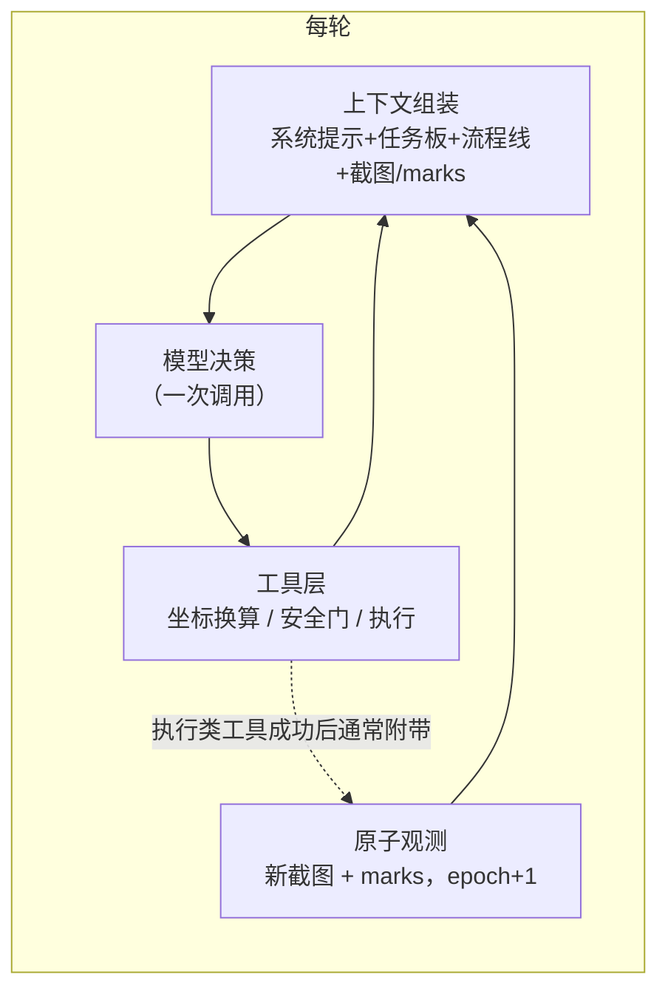
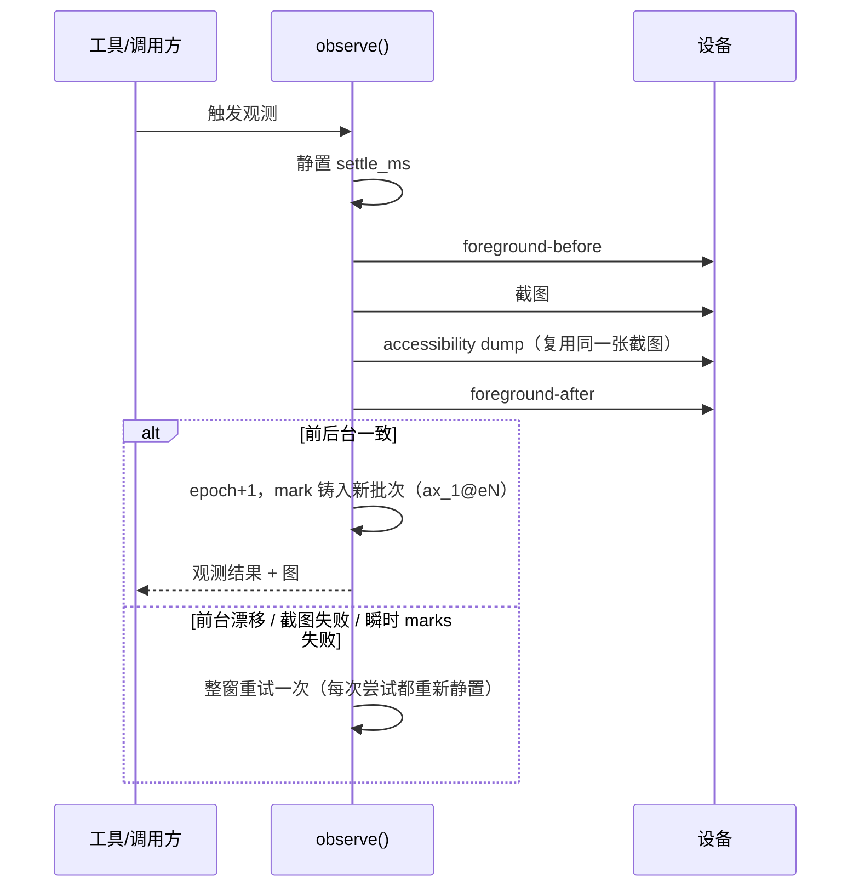

# 架构

## 主循环

每个决策周期一次模型调用；模型通常只给一个工具调用，也可能给出多个——harness 按声明顺序逐个执行，终局
转换后跳过剩余 sibling。执行类工具成功后通常会附带新的原子观测，但并非每个工具都会产生观测（例如 TaskDoc
更新、finish），观测也可能失败（只返回文字或未验证参考图）。



harness 不做流程编排：没有节点、没有路由，任务规划由模型通过 TaskDoc 任务板自行维护。

## 坐标与寻址 {#coords}

模型只处理 **0-1000 相对坐标**：marks 摘要给出 `(x,y)` 相对中心，`swipe` 的 `start` / `end` 也是相对值，回执按相对值回显。相对值 → 绝对像素的换算只在工具内部完成（`phone_agent/v2/coords.py::convert_relative_to_absolute`，按当前屏幕宽高线性映射），换算不做边界钳制，越界相对值会外推。模型的可见文本里不出现绝对像素；`locate` 的执行 artifact 携带定位输入图与整帧的分辨率供诊断与渲染，属于工具执行元数据，不进模型上下文。

## mark 寻址与批次 {#marks-first}

执行动作必须绑定 mark：

| 工具 | 目标参数 |
|---|---|
| `tap` / `long_press` | 只接受 `target_mark_id` 或 `target_description`，二者皆缺或解析不唯一即拒绝执行 |
| `type_text` | 目标可选；缺省时向当前焦点输入框输入 |
| `swipe` | 唯一接受裸相对坐标（`start` / `end`）的执行工具 |

mark id 带批次徽章 `ax_1@e12`。每次成功观测使 epoch 前进并整体重铸 marks，上一批 id 全部失效；`resolve_mark` 对徽章 epoch 不等于当前 epoch 的 id 直接拒绝（提示重新观测），无徽章的 id 只查当前批次表。命中失败与描述歧义同样 fail-closed。成功 `locate` 同样开启新批次：epoch 前进、旧 marks 清空、只铸入命中的 mark。

## 原子观测 {#atomic-observation}

观测由唯一生产者 `session.observe()` 完成：静置 `PHONE_AGENT_OBSERVE_SETTLE_MS`（默认 300ms）→ 取前台组件 → 截图 → 同帧 marks（复用该截图）→ 再取前台组件；前后台不一致、截图失败或瞬时 marks 失败时整窗重试一次：



每次尝试都重新静置，最多两次。触发重试的条件有三类：截图或采样抛错、前后台组件变化，以及首次尝试遇到瞬时 marks 失败（抓取超时、provider 失败、AX 解析失败；窗口化采集不支持也归为 provider 失败）。空屏（无控件可交互）属于稳定结果，不是瞬时失败，直接提交零 marks 帧。第二次尝试只在截图有效且前后台一致时提交，失败码随帧显式标注，不装成“本屏无控件”；第二次截图仍失败或前台再次漂移则作废整批 marks 并抛错，本次调用取得过的最后一张有效截图只降级为未验证参考图。

每次成功观测使上一批 mark 全部过期；执行动作引用过期 mark 时在 `resolve_mark` 处拒绝。模型能寻址的始终是
**当前已观测批次**的 mark；观测之后屏幕仍可能变化，动作是否生效以设备回执为准。

### 观测的三种结果

| 结果 | 条件 | 模型看到什么 |
|---|---|---|
| 提交成功 | 截图有效、前后台一致；瞬时 dump 失败重试一次后仍失败时提交标注过的零 marks 帧 | 当前帧 + 当前批次 marks（可能为 0，带 `marks (0) [accessibility:<code>]` 诊断） |
| 未验证参考图 | 本次尝试取得过有效截图，但整个观测窗口最终失败 | 最近一张有效图，明确标注“较早采样、未验证、非当前可操作批次”；**不提交** epoch/`screen_seq`/几何，不铸 mark |
| 纯失败文字 | 全程没有有效截图（含被 `secure_screenshot_blocked` 拦截，该类失败不保留参考图） | 只有事实性错误文本，不伪造画面 |

参考图是普通多模态图片（受历史图片剪除约束），永远不能用来寻址——旧 `ax_*@eN` 仍然 fail-closed。动作成功
的回执也不会因为随后的观测失败而被降级成“动作没执行”。

`PHONE_AGENT_BLACK_SCREEN_DETECT`（默认开）把全黑截图（各通道 RGB 最大值 ≤ 4）判为 `secure_screenshot_blocked`：这是 fail-closed，不返回黑图，也不保留参考图。系统保护页是另一个来源——只有 screencap stdout 显式含 `Status: -1` / `Failed` 才走该码；非零返回码、pull 失败与其它异常分别是 `adb_screencap_failed` / `screenshot_pull_failed` / `screenshot_unavailable`，这些非 secure 失败在有有效截图时保留参考图。

### 批次与几何的状态转移

| 事件 | epoch | marks | 几何与 `screen_seq` |
|---|---|---|---|
| 观测提交成功 | +1 | 整体重铸为新批次 | 提交新值 |
| 观测失败 | 冻结 | 清空 | 冻结 |
| `locate` 命中 | +1 | 清空后只铸入命中 mark | 提交新值 |

观测失败是**整批作废**：不残留任何可寻址 id，模型必须重新观测才能继续动作。

## 窗口化 marks {#windowed-marks}

屏幕默认按窗口分组呈现（`uiautomator dump --windows`，设备不支持自动回退单根模式）：

```
W1 TYPE_SYSTEM com.android.permissioncontroller layer=42 active focus
  ax_1@e12 | Button | 仅本次允许 | (500,522) | op=confirmed | path=dialog
W2 TYPE_APPLICATION com.tencent.mm layer=10 covered_by=W1
  ax_3@e12 | ImageButton | 返回 | (58,35) | op=blocked | path=toolbar
```

- 可操作性四档：confirmed（真窗口证据+未被覆盖）/ likely（默认）/ blocked（仅真 layer 证据：被高层弹窗覆盖）/ unknown（弱窗口中心被更高推断窗遮盖，`maybe_covered_by`，只是提示）；blocked 只展示不拦截；
- `op` 标注只出现在窗口化渲染；回退到单根渲染时不输出该字段；
- 分组条件是出现多个不同窗口，或存在真窗口证据（layer/type）；否则按平铺布局渲染；
- 名额按窗口配额分配，顶层弹窗有保底；
- 寻址语义不变：执行动作仍只认当前批次的 `ax_*@eN`；`op` 与窗口归属不参与 `resolve_mark` 判定，不是执行门控；
- dump 失败（超时/解析错）触发一次重试，最终失败在观测文本显式标注，不装成“本屏无控件”。

`PHONE_AGENT_MARKS_WINDOWED` 三档：`auto`（默认）先试窗口化 dump、设备不支持则回退单根；`on` 强制窗口化，采集不支持时可见失败；`off` 只跑 legacy 单根 dump。分组判定只看窗口集合：legacy dump 出现多个顶层 node 时每个 node 算一个弱窗口，仍判 grouped 并按窗口渲染、输出 `op=`；弱窗口没有真 layer/type，只可能落 likely 或 unknown（被更高推断窗遮盖即 unknown），到不了 confirmed 或 blocked。三档只影响分组、标注与渲染，不改寻址、执行、安全门、图片/摘要折叠与 `locate`。

## 单批执行 {#single-batch-execution}

同一轮模型给出的多个工具调用由 execution-admission 监听器**串行**执行：整个调用期间持有可重入锁，并按 provider 的并发上限 1 保证声明顺序。进入终局转换（finish 被接受或 takeover 被接受）后，同轮剩余 sibling 不再执行，只收到 status 为 error 的 skipped 回执。`PHONE_AGENT_PARALLEL_TOOL_CALLS` 只是 provider hint（默认下发 `parallel_tool_calls=false`；设 `true` 则不发送该 hint），不解除串行。<!-- allow:不再 -->

## App 名解析 {#app-name-resolution}

`launch_app("哔哩哔哩")` 的名字→包名解析分四层：归一化 → 多路候选生成（精确别名 / 词汇 / 拼音 / 嵌入向量）→ 先验排序 → 证据分型三态决策（resolved / ambiguous / unknown）。这一归属唯一在 `phone_agent/v2/names.py`，包括归一化、包名去重、先验排序与三态判定。

- 默认 `typed` 决策。强证据类型（`exact_alias` / `exact_label` / `exact_package` / `exact_package_segment` / `registered_containment`）才可单独 resolved；弱证据（`fuzzy` / `pinyin_full` / `pinyin_initials` / `embedding`）永不单独 resolved，只产出排序候选交由模型选择。带成功计数的 `learned` 别名在非弱证据类型下也可单独 resolved；
- 产品名恰为包名片段（`exact_package_segment`）只接受完整包段相等：包名按 `.` / `_` / `-` / camelCase 切段，过滤无意义段与长度不足 4 的段；`Firefox` 匹配 `org.mozilla.firefox`，`fox` 不匹配；
- resolved 之后仍要过装机清单与 launch policy 两道独立校验——名字匹配永不授予启动权限；
- `rank_score` 只用于排序、分差、回执与 trace，不单独赋予执行 authority。

## 图片与观测历史剪除 {#image-hygiene}

每次模型调用前，`phone_agent/v2/middleware/images.py` 做两趟独立的、幂等的 micro：

| 趟 | 保留 | 旧内容变成 |
|---|---|---|
| 图片剪除 | 最新 `PHONE_AGENT_IMAGE_KEEP`（默认 2）条含图消息的图片块 | `[screen#<n> 已剪除]` 文本占位 |
| OBS marks 折叠 | 最新 `PHONE_AGENT_OBS_MARKS_KEEP`（默认 2）条观测的完整 `marks (K):` 摘要 | 一行 `[OBS] app=X screen#N [marks 已折叠:K]` 占位 |

两趟都按“含图消息”/“含 marks 的观测”逐条计数，而不是按图片块计数；两个上限都钳到至少 1。占位符不带图片块、折叠行不带 `marks (` 标记，因此重跑不会再次改写已经处理过的历史（滚动窗口之外的稳定前缀不变）。

工具成功通常回传新截图；没有截图载荷时（安全保护屏、观测窗口最终失败且无有效截图、`locate` 无暂存帧）只回文本。

**原生签名冲突**：若本会被剪除/折叠的块带原生重放元数据（签名、加密状态等，含标准 text/image 块嵌套 `extras` 内的键），micro 在修改任何消息**之前**全量预检，并以 `native_context_pruning_conflict` 明确失败——不丢签名、不搬签名、也不为签名多留旧图。同一消息里其它块的签名不阻止无签名旧块被清理。compact 开启时该 micro 随压缩一起跑；`PHONE_AGENT_COMPACT=off` 时仍有专用监听器执行同样的清理。

## 工具回执与失败语义 {#tool-fail-closed}

工具回执写在对话里，模型下一步能看到。失败返回错误文本，绝不伪装成功：

| 场景 | 回执 |
|---|---|
| 设备命令可能已下发但结果不明 | `error: {动作} 的设备命令失败；命令可能已发送，设备结果无法确认。`（只说明结果未知，不声称未执行） |
| 文本输入命令可能已发送但无法确认 | `error: 文本输入命令可能已发送，输入结果无法确认` |
| 文本已发送、键盘恢复失败 | 保留 `已输入 …；输入已发送；键盘恢复失败` |

文本输入的 base64 负载在派发前经 shell-quote；ADB Keyboard 的 warm-up 参数以真实空串送达。当输入法已确认切换但 warm-up 失败时，device helper 先尝试恢复一次已知原 IME，再分开报告“用户文本未发送”与恢复结果（已恢复 / 恢复命令失败且键盘状态未知 / 未执行需要恢复的切换）。工具失败与错误文本留在 transcript，不会被静默吞掉。成功回执通常带新的 `[OBS]` 观测块（多模态内容列表），错误回执是纯文本。

## 设备访问 {#device-factory}

所有设备操作统一经 `phone_agent/device_factory.py` 的 `DeviceFactory` 解析到 `phone_agent/adb/`；v2 侧只有 `v2/session.py` 持有 factory 句柄。设备序列号可显式指定，未指定时自动识别（多设备时必须指定）。v2 代码里没有裸 `subprocess` 调 ADB 的路径。

## TaskDoc 任务板 {#taskdoc-board}

`goal_base` 由 harness 在 run 开始时从任务原文播种，模型**不可写**；`update_task_doc` 只能改路线项、事实与 amendment。

- `[TASK_DOC]` 块每轮 pin 进上下文（作为 pinned 系统消息，带固定 id 去重替换），压缩时归入保护组、不参与折叠；
- 有 open 路线项（`pending` / `in_progress`）时 `finish` fail-closed，回执列出未完成项并要求先完成、标 `blocked`（带原因）或修正路线；
- 迁移规则：`pending` → `completed` 必须经 `in_progress`；单次提交把 ≥2 条 `pending` 直接标 `completed`（批量补标）被拒；新 id 直接以 `completed` 引入被拒；先前的 `pending` id 从板上消失被拒（只能迁移）；

| 结构上限（字符） | 值 |
|---|---|
| 路线项条数 / 单条正文 | 15 / 500 |
| 单条证据 | 500 |
| 事实条数 / 单条 | 10 / 120 |
| amendment 条数 / 单条 | 10 / 500 |
| TaskDoc 正文渲染（`TaskDoc.render()`） | 4000 |

渲染超过 4000 字时按可截断段（amendment、事实）回删并留 `…(已截断)` 标记；`goal_base` 与路线项永不截断，因此保护内容自身超限时输出可以超过该值。pin 进上下文的整块在正文之后还会拼上 `## 流程线`（最多 8 条流程条目），因此整块长度可以超过 4000。

## 流程线与输出契约 {#output-contract}

每个工具调用都带 `intent`（本步目标，system prompt 要求必填）与可选的 `note`；两者在 schema 上都是可选参数，缺省分别是空串与 `null`。工具回执写实际发生了什么（如 `已点击「上海」(ax_3)`、`已输入 '…'`），流程线据此派生出真实账本。

流程线由 transcript **纯派生**，不持有 session 状态：取最近 8 步，格式为 `#N <intent> → <工具><目标> → <状态>｜note`，各字段有长度截断。停滞轻推不产生行为，`PHONE_AGENT_TASKDOC_NUDGE_STEPS` 是保留的 no-op。

## finish 两段式与验收 {#finish-two-step}

1. **两段式**：首次 `finish` 返回复核包（世界事实、路线状态、疑点、选项四节，目标只随 pinned 的任务板出现），模型带 `confirm=true` 再次调用才定稿；`finish` 的 `evidence` 参数必须非空，空列表被拒且不记录任何状态；声明 `completed` 的路线项必须带 `evidence_note`，缺证据的声明被拒。复核包记录当时提交的屏幕序号，`confirm` 时比较当前序号；序号已前进则重新出复核包。`PHONE_AGENT_FINISH_VERIFY=off` 退化为单段落定，不生成复核包、不做序号守卫。
2. **终局**：被接受的 finish 立即终局——同轮后续 sibling 工具调用不再执行，收到 status 为 error 的 skipped 回执（`自动化已终止；该后续工具调用已跳过。`），且此后不再采样模型。被接受的 `take_over` 同样终局；被拒绝的 `take_over` 不设终局，run 继续。<!-- allow:不再 -->
3. **独立验收器**（`PHONE_AGENT_FINISH_VERIFY`，默认 `auto`）：上下文独立于 actor，只看目标、证据路线与尾部截图，**绝不读 actor transcript**；TaskDoc 关闭时以 run 的原始目标为权威。`auto` 档在目标命中高风险词表，或复核发现硬矛盾（最后一步工具失败、观测无效、前台回到 Launcher）时触发；`always` 总是触发；`off` 关闭。验收器连续两次拒绝转为 `take_over`。
4. **故障 fail-open**：验收器构建或调用失败时放行该 finish 并记审计状态 `skipped`，绝不记 `pass`。

## 产出物（deliverable） {#deliverable}

`PHONE_AGENT_DELIVERABLE=on`（默认）时挂载 `write_document` / `update_document` 两个工具。`write_document` 收 `title` 与 `html`，`update_document` 只收 `html`；模型绝不给路径：目标固定为 `PHONE_AGENT_DELIVERABLE_DIR/<run_id>.html`（UTF-8，上限 256 KiB，恰好 256 KiB 允许）。

- create 拒绝已存在的文件；update 拒绝缺失、非普通文件与 symlink；
- 任何失败返回错误字符串，并保证不改动先前写好的文档；
- 没有删除工具；控制台里的删除是用户侧操作；
- 生产 trace 不落 HTML 正文（只记字节数），episode 档案的 `deliverable_path` 只在本 run 成功写出后非空。

## Trace 与脱敏 {#trace-redaction}

每个 model/tool 事件追加写入 `<trace_dir>/<run_id>.jsonl`（`PHONE_AGENT_TRACE` 默认开，`PHONE_AGENT_TRACE_DIR` 默认 `.traces`）：

- 文本字段先脱敏敏感子串，再按**字符**截断到 64 字符（超出补 `…`）；
- 截图 base64 永不落盘：图片块替换为 `{type, screen_seq, bytes}`，`bytes` 是按 base64 长度估算的字节数；
- 交付物的 HTML 正文作为工具参数时整段略去，只留 `{"type": "text", "omitted": true, "bytes": N}`（顶层参数；嵌套出现的同名参数按 64 字截断规则处理）；
- context 请求观测只输出数字与有界标签（角色、尝试序号、消息数、容量判断、估算来源与覆盖范围、实际协议、缓存模式）。指纹口径是调用前的有序客户端消息，provider 仍可能提升 system 或合并块，因此不冒充服务端精确 token 前缀；`attempt_scope=handler_invoke` 只区分显式备用尝试，不声称观测到 SDK 或网关内部的每次 HTTP 重试；
- usage 四元组（input / output / cache read / cache write）缺失记 `null`，与明确的 `0` 分开；trace 的 `model_call` 调用失败时整键缺席这四个字段；缓存输入仍计入上下文与原 token 预算。

## 约束（P0） {#p0}

| 域 | 约束 |
|---|---|
| 坐标 | 0-1000 相对坐标换算只在工具内部；模型不接触绝对像素（见[坐标与寻址](#coords)） |
| Marks-first | 执行动作必须绑定 mark；歧义/未命中/过期一律拒绝执行（见[mark 寻址与批次](#marks-first)） |
| 图片卫生 | 只保留最新 `PHONE_AGENT_IMAGE_KEEP` 条含图消息与最新 `PHONE_AGENT_OBS_MARKS_KEEP` 条完整 marks（见[图片与观测历史剪除](#image-hygiene)） |
| 安全 | 风险执行调用默认先预警、确认后执行；见[安全模式](safety.md) |
| 工具 | 失败返回错误字符串；可能已下发设备命令但结果不明时如实说明，绝不假报成功（见[工具回执与失败语义](#tool-fail-closed)） |
| Trace | 文本超 64 字截断、敏感子串脱敏、截图 base64 不落盘（见 [Trace 与脱敏](#trace-redaction)） |
| 设备 | 设备操作统一经 DeviceFactory；无裸 ADB 调用（见[设备访问](#device-factory)） |
| 配置 | CLI > shell env > .env > 默认；见[配置参考](configuration.md) |

## 上下文工程

每次模型调用的上下文组成：

| 块 | 生命周期 | 说明 |
|---|---|---|
| 系统提示 + 工具 schema | 静态 | 工具契约与安全规则 |
| TaskDoc 任务板 | run 内 | 模型自维护的目标与路线；pinned，压缩时保留 |
| 流程线 | run 内 | 最近 8 步"意图→工具→结果"，从 transcript 推导 |
| 应用清单/记忆 | 跨 run | App-KB 事实；`MEMORY_RAG=on` 时按三时机注入晋升经验（开局 / mention 预取 / 进场） |
| 截图 + marks | 每步 | 当前世界状态；历史图片滚动剪除 |
| 窗口结构 | 每步 | marks 按窗口分组 + 可操作性标注（windowed dump 支持时） |

上下文管理分开处理物理窗口、完整输入工作目标与 run token 预算。默认工作目标为 32k，压缩后目标为其 70%；窗口仍保留 0.75 提醒、0.92 触发的保护线。每轮图像/marks 清理是确定性 micro，语义摘要按完整 AI/所有 sibling 工具回执组归并，保护最新观测与当前 TaskDoc；摘要前后检查容量和净缩减，失败保留已做 micro 的基线。缓存命中不减少逻辑窗口占用，也不改变信息保留策略。详见[配置参考](configuration.md)。

工作目标是软限制。保护内容超过软低水位时，物理容量修复仍可进行并标注 `soft_target_unattainable`；不能为凑目标删除完整工具组。原生签名/加密元数据在标准块的嵌套 `extras` 中也受到保护。若必须 micro 的旧观测含无法合法保留的签名，先全量预检再明确失败，不静默丢签名、挪签名或放宽 K。

### 上下文请求与缓存观测

主模型与已配置的备用模型每次尝试各自进行 Provider 上下文准备和容量检查。缓存标记只添加到请求副本，
不写回任务历史；备用模型不会继承首选的缓存标记，也不会为了适应较小窗口在请求里偷偷删历史。
摘要、验收器、安全复核和离线蒸馏同样使用模型自己的准备能力；验收器仍只读取独立的目标与证据上下文。

生产 trace 的 `context_request` 给出实际客户端协议、估算来源/覆盖范围、容量判断及有序消息差异。
`fingerprint_basis=ordered_client_messages` 只表示 SDK 调用前的消息顺序；Provider 仍可能提升 system 或合并块，
不能拿它当服务端精确 token 前缀。`model_attempt_usage` 的 `attempt_scope=handler_invoke` 区分显式备用尝试，
不声称已观察 SDK/网关内部每次 HTTP 重试。

`model_call` / 模型事件记录可空 `input_tokens`、`output_tokens`、`cache_read_tokens`、`cache_write_tokens`：
缺失和明确 0 分开；兼容普通、priority、flex 的缓存明细；trace 的 `model_call` 调用失败时这四个键整键缺席、
只有 `error` 与延迟，Web 事件流的同名失败分支仍带四个 `null` 键。
只输出数字，不输出 prompt、HTML、认证信息或截图。缓存 token 只在用量台账里按角色累计求和，没有命中率计算；
缓存输入仍计入上下文与原 token 预算。这些字段用于定位缓存行为，不引入金额预算或价格换算。

## 记忆

三层结构：App-KB 事实库（已上线）、episode 经验档案（已上线）、RAG shadow 回想（已上线，默认不注入）。详见[记忆](memory.md)与[自进化](evolution.md)。

## 扩展性

策略层完全事件化：LangChain 中间件栈只有 5 个桥接器，另有可选的 `extra_middleware` 观察者（控制台注入 Web 事件投影）。安全预警、上下文压缩、token 预算、trace、诊断全部是事件总线上的监听器（嵌套顺序 = 注册顺序；内建链里 safety 位于 `tool/execute` 最内，插件经 `ctx.on` 追加的监听器比 safety 更内）。外部插件与内建能力共用同一装配层，可挂监听器、工具、提示块、run hooks 与 CLI 命令。详见[插件开发](plugins.md)。
