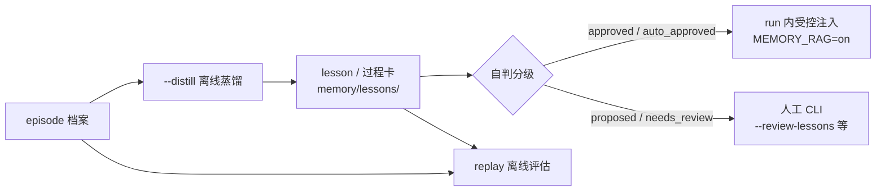

# 自进化

自进化是记忆的派生面：蒸馏把 episode 档案变成 lesson 与过程卡，分级决定哪些可注入，注入在 run 内以"参考提示"
身份出现，replay 离线评估通道是否值得保留。记忆数据面本身见[记忆](memory.md)，配置键与默认值见[配置参考](configuration.md)。



## 提炼、晋升与回注 {#distill-promote}

- **提炼**：`--distill` 离线蒸馏——按水位线取新档案整批交给 LLM（每张卡含目标原文、逐步 intent/note 账本与
  结局，外加 harness 机械算出的 struggle_markers：报错步/弯路重走/finish 驳回数；单批上限 40 条）。harness
  只做三件事：**核验客观事实**（严格 JSON、证据 run_id/task_keys/scope 必须逐字引自本批次、kind 形状、steps
  不得含坐标/mark id/工具字面量）、**供给事实表**、**自填簿记字段**（lesson_id/support_count/时间戳等，模型
  只输出语义字段）。语义判断全部归第二次调用的模型自评；仅引用成功 run 的卡也进入自评，由自评结合事实表定夺；
- **游标**：一批处理完就推进 `(ts_end, run_id)` 水位线，不重复消费。三种收尾都推进水位线：正常处理（候选各自
  落 `lesson_proposed` / `lesson_superseded` 事件）；蒸馏 token 预算耗尽（该批跳过、不调用模型，写
  `distill_batch_skipped`，默认预算取 `PHONE_AGENT_TOKEN_BUDGET` = `1000000`）；同一批连续失败 3 次后放弃
  （写 `distill_batch_abandoned`，fail-open 但不静默）；
- **晋升**：蒸馏自判分级为主（auto_approved 两类均可注入），人工 CLI（`--approve-lesson` / `--revoke-lesson` /
  `--supersede-lesson`）是纠正通道而非闸门，版本链可撤销（supersede 即下线，重新批准才恢复注入）；
- **维护**：dream 对账——证据档案被折叠后失去依据的 approved 经验自动降回草案（`lesson_demoted`，停止注入，
  需重新批准）；并按"注入组 vs 未注入组"成功率统计每条经验的实际效果，被注入 ≥2 个 run 的经验才进报告
  （`LESSON_EFFECTIVENESS_MIN_RUNS = 2`），更差的列入建议撤销清单（只提醒，不自动撤）；
- **回注**（`PHONE_AGENT_MEMORY_RAG=on`）：已批准的经验在 run 开局以"参考提示"身份注入（上限 3 条 / 800 token，
  设备 scope 过滤，run 内钉死该代）；注入的 lesson id 写入 trace 与 episode 档案，用于事后度量"注入是否有帮助"；
- **约束**：只有 approved / auto_approved 可被注入；proposed/needs_review/revoked 永不注入；shadow/off 档完全
  不注入。召回侧加固：embedder 在 capability 挂载时**主线程同步预热**（on/shadow 且配置了索引才触发；避免后台
  线程与 run 开局召回并发加载共享的 MLX 原生栈）；选择器异常留痕（trace `recall_selection_error` + stats 错误
  计数），embedder 预热失败只留 trace、不计入 stats；fail-open 语义不变。

原则：先记录、再影子验证、晋升靠蒸馏自判分级（auto_approved 两类均可注入）、人类 CLI 是纠正通道，注入有上限
可撤销；每一步可回退。

### 进化状态机契约 {#lesson-evolution}

蒸馏、晋升与撤销的常规写入都在显式离线命令（`--distill` / `--review-lessons` / `--approve-lesson` /
`--revoke-lesson` / `--supersede-lesson`）里发生；run 内唯一的写入通道是应急撤销
（`ThinPhoneAgent.revoke_lesson`），其余都是只读——run 开局的注入选择、投递前的权威视图复检、app 规则快照
都只读它的物化视图。dream 降级在 run 之间执行。

- **批次**：`--distill` 按水位线游标（上一批的 `(ts_end, run_id)`）取新档案，单批上限 40 条
  （`_DISTILL_BATCH_MAX`），处理完推进游标、不重复消费；同一批次连续失败 3 次后放弃该批并记录
  `distill_batch_abandoned`。状态与失败指纹落在 `memory/lessons/distill_state.json`，指纹字段有
  `last_error_class` / `last_error_detail` / `last_error_status` / `last_error_cause` / `last_error_phase` /
  `last_error_elapsed_ms`（文本单行、脱敏、截断 200 字），重试计数到第三次才放弃；
- **核验的边界**：harness 只拒可判定的假话——严格 JSON、证据 `run_id` / `task_keys` / `scope` 必须逐字引自
  本批次（闭世界引用）、`kind` 形状、语义步不得含坐标 / mark id / 工具字面量。违规按候选逐条丢弃，不整批拒绝；
  不存在"失败锚定"或复现次数硬门槛；
- **分级**：第二次调用按 harness 供给的事实单统一自评，拿不准一律落 `needs_review`；任何分级失败都 fail-open，
  绝不丢候选（记 `distill_grading_failed`）。分级审计 `grade` / `grade_basis` / `fact_sheet` 随 `lesson_proposed`
  与 `lesson_superseded` 事件落 `memory/lessons/events.jsonl`，是事件级溯源，不进 lesson schema；
- **状态集合**：`proposed` / `needs_review` / `auto_approved` / `approved` / `revoked` / `superseded`。只有
  `approved` / `auto_approved` 可注入；已被撤销的 id 重新提交到达即降级（规则降回 `proposed`，过程卡降回
  `needs_review`），并写 `revoked_reproposal_demoted` 审计，该降级只由显式批准清除；
- **存储**：LessonStore 的读写都在进程锁 + 文件锁内进行，先重放权威事件再原子重写视图（临时文件 + fsync +
  replace），因此并发写不会产生半更新的视图；
- **dream 降级**：唯一触发条件是证据丢失——lesson 引用的 run 已不在当前物化的档案视图里，够格的已批准经验降回
  草案（`lesson_demoted`，停止注入，需重新批准）。dream 同时按"注入组 vs 未注入组"成功率给出建议撤销清单
  （只提醒，不自动撤）。

### 召回与投递契约 {#lesson-injection}

索引由 `phone_agent/v2/recall.py` 维护，分三个命名空间：`episode`、`app_alias`、`procedure`。索引可全量重建
（`--rebuild-vec`）、可增量更新（run 结束时）、可对账（dream 时），三者共用同一份事件真相，因此删掉索引文件不会
丢数据。

episode 语义榜是 FTS5 关键词与向量的混合分：`0.75 × 向量分 + 0.25 × 关键词分`。向量门槛平时是
`PHONE_AGENT_RECALL_MIN_SCORE`（默认 `0.50`）加 `0.10`，查询词在文本里精确命中时放宽回 `0.50`；时间衰减
（`PHONE_AGENT_RECALL_DECAY_LAMBDA`，默认 `0.02`/天）只做同分决胜；名额由 `PHONE_AGENT_RECALL_TOP_K`（默认
`1`）控制；device scope 是命中条件而非打分项。

`PHONE_AGENT_MEMORY_RAG` 三档的边界：

| 档位 | 行为 |
|---|---|
| `shadow`（默认） | run 开局做一次召回，只写 trace 与统计，**绝不进 actor 上下文** |
| `on` | 按下面的契约注入可注入 lesson；recall 结果本身仍不进上下文 |
| `off` | 能力不挂载，不召回也不注入 |

`off` 档下 recall 能力整体不挂载，挂在它名下的离线命令（`--rebuild-vec` / `--distill` / `--review-lessons` /
`--approve-lesson` / `--revoke-lesson` / `--supersede-lesson`）直接报 capability 不可用并以退出码 1 结束。

**可注入的只有 `approved` / `auto_approved` 两类 lesson**；`proposed` / `needs_review` / `revoked` /
`superseded` 永不注入。投递前按权威视图复检每一项，任一项不成立只抑制该次投递（不影响其余项），并区分原因：
`snapshot_missing`、`snapshot_corrupt`、`lesson_missing`、`not_injectable`、`version_mismatch`、`no_lesson_id`，
以及 run 内撤销的 `runtime_revoked`。规则与过程卡的抑制计数独立（`rule_suppressed` / `latest_rule_suppressed`
与 `procedure_suppressed` / `latest_procedure_suppressed`），只记 lesson id、原因与类型，不落经验正文。可选记忆
缺失、坏快照、诊断写失败一律 fail-open：下一次模型调用照常进行。统计固定写在 `<memory_dir>` 下的
`experience/recall_stats.json`。

app 规则只在 `on` 档被选中与计数：`shadow` 档既不选也不计数（过程卡的 mention 预取在 shadow 档仍选择卡片，
只记录不注入）。

### 过程卡（procedure card）

lesson 管道的第二种产物：rule 是单条行为规则，过程卡是多步流程经验（`kind=procedure`，字段 `steps`（纯语义步，
禁坐标/工具参数）+ `pitfalls` + `app_scope`）。蒸馏第一次调用同产两类候选，第二次调用对**两类统一自判分级**——
harness 只供事实单（证据结局/每 run 报错回执数/跨任务复现数/历史同题次数/与已批准课的矛盾/support 实算，过程卡
加 app 包名是否验证过），模型按非对称风险标尺定级：拿得准直接 `auto_approved` 可注入（**两类均可**），拿不准落
`needs_review`（不阻塞）；人类 CLI 是纠正通道而非闸门，dream 降等负责回收错课。

匹配是硬过滤加软排序：app 包名精确相等（绝不用 embedding）、device scope 命中、goal 与卡摘要（title + steps）
cosine top-1（阈值 0.30，真实数据扫描拐点）。注入三个确定性时机、与 run-start 规则镜像各占额度（卡单独 1 张/约
300 token，app 规则 ≤2 条/200 token）：run 开局注入通用卡；**mention 预取**——goal 文本经 typed resolver 判为
resolved 的 App（≤2 个）在规划前就预取其卡+app 专属规则；**进场注入**——`app/launched` 事件多源化（launch_app
成功 或 前台包检测，系统包过滤），进 App 即送该 App 的卡+规则。三个时机共享「每包每 run 至多一次」去重。蒸馏
指引：跨 App 交接类课按涉及 App 各产一份候选（scope 各挂对应包名），保障链式任务每个 App 进场都能拿到交接纪律。

## 通道离线评估（replay）

`phone_agent/v2/replay.py` 在内存 `VecIndex`（`:memory:`，不碰生产索引）里重放 `memory/experience/events.jsonl`，
为"某条通道是否值得上线"提供离线证据。

### 成功先例通道（exemplar）

"成功先例通道"设想在 run 开局注入一条同类任务的成功 episode 作为先例，注入本身**尚未上线**，replay 只回答
"是否值得注入"。它按 `ts_end` 时间序重放 episode 日志，模拟每次 run 启动时的召回窗口，取语义召回 top-1 成功
先例，测三道闸：

- **coverage（可用率）**：多少 run 能召回到一条够格（成功且步数 ≥ `min_steps`）的先例；达标线 ≥ 0.30；
- **relevance（相关性）**：命中先例是否与当前 run 同 `task_key`；在已 covered 的 run 中达标线 ≥ 0.70；
- **steps-delta（更高效）**：先例步数是否比当前 run 更少（`当前步数 - 先例步数`，>0 表示先例更省步）；以中位数
  >0 为达标线。

三闸全过才建议开通道（`channel_recommended`）。无时间旅行按更严格的口径执行：候选必须
`candidate.ts_end < query.ts_start`——先于本 run **开始**，重叠的 run 不合格。

### 过程卡通道（procedure）

过程卡通道只在本次 run 已启动过的 app 池里选卡，口径与 exemplar 不同：`coverage >= 0.30` 与
`app_grounded_hit_rate >= 0.60` 是**下限**，不是语义相关性——候选池已按包硬过滤，命中只说明 top-1 来自 app 池
而非 general 池。`steps_delta` 恒为 N/A（过程卡正是从这些 episode 蒸馏出来的，没有可减的反事实步数），不参与
通道判定。

### 运行

```bash
.venv/bin/python -m phone_agent.v2.replay --channel exemplar
.venv/bin/python -m phone_agent.v2.replay --channel procedure --sweep
```

参数：`--channel`（`exemplar` 默认 / `procedure`）、`--experience-dir`（默认 `memory/experience`）、
`--lessons-dir`（默认 `memory/lessons`，仅 procedure）、`--min-steps`（默认 2，够格 episode 的最小步数）、
`--min-score`（默认 0.50，召回分阈值）、`--top-k`（默认 1，仅 exemplar）、`--sweep` 与 `--calibrate`
（仅 procedure；`--sweep` 扫 `0.30..0.70` 步长 `0.05` 推荐拐点，`--calibrate` 为冷启动阈值调优专用，打破无时间
旅行、不参与通道判定）。

## 离线命令与运行期应急撤销

```bash
.venv/bin/python main_v2.py --distill
.venv/bin/python main_v2.py --review-lessons
.venv/bin/python main_v2.py --approve-lesson les_0123456789ab
.venv/bin/python main_v2.py --revoke-lesson les_0123456789ab "证据不足"
.venv/bin/python main_v2.py --supersede-lesson les_0123456789ab "改写后的规则正文"
```

`--review-lessons` 交互逐条打印候选、事实参考、分级审计与效果建议，给出 [a]pprove / [r]evoke / [s]kip 三选一：
批准不设闸门，撤销要写理由，skip 不动日志。`--supersede-lesson` 保留 lesson id、把正文改写为下一版并回到
`proposed`。这些命令都注册在 recall 能力下，`PHONE_AGENT_MEMORY_RAG=off` 时报不可用。

- **运行期应急撤销**：`ThinPhoneAgent.revoke_lesson(lesson_id)` 立即把 id 写进权威 store
  （`emergency_revoke_lesson`），并从注入器排除；已经发出的历史消息不改写，后续所有投递点都忽略该 id。
- **索引同步**：CLI 撤销（`--revoke-lesson` 与 `--review-lessons` 的 r 分支）对过程卡额外删掉索引里的派生行
  （`delete_index_procedure`），下次对账会重新同步；索引缺失或删除失败只影响这条回执，不影响命令成功。
