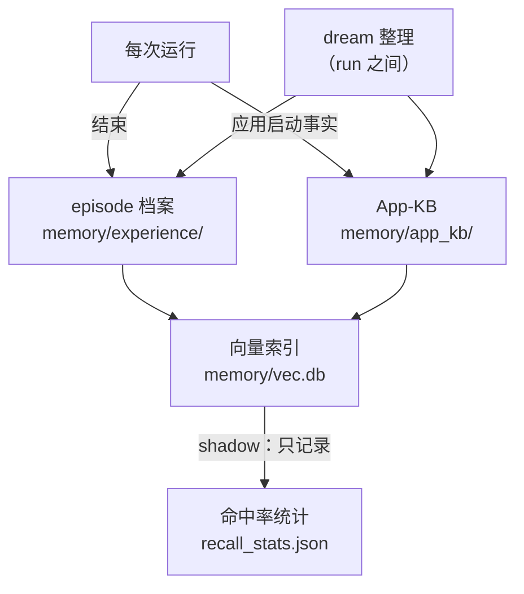
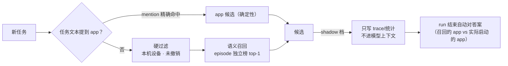

# 记忆与自进化

TaskWizard 的记忆分三层，全部本地存储（`memory/`），不依赖外部服务。

## 总览

## 第一层：App-KB（应用事实库）

记录本机可启动应用及其别名，按设备序列号隔离。

写入路径：

| 来源 | 条件 | 优先级 |
|---|---|---|
| `device` | run 启动时同步本机应用清单 | 最低（可被覆盖） |
| `learned` | 启动成功且叫法与官方名不同；或"中文叫法失败→候选包名成功"的隐式纠正 | 中 |
| `user` | 用户明确纠正（`--learn-alias 名称=包名`） | 最高 |

管理入口：`--learn-alias` 写入 user 别名、`--forget-alias` 删除 user/learned 别名（device 条目不动）。

错误别名纠正：dream 在整理时识别"启动 A → 1-2 步内模型自述开错并退出 → 启动 B 成功"的签名，直接覆盖错误 learned 映射（仅保存命中的自述词，不落完整模型 note）；user 别名阻止自动覆盖。

App 名解析（启动时的名字→包名）：归一化 → 多路候选生成（精确/词汇/拼音/嵌入向量）→ 先验排序 → 证据分型三态决策。设备事实类强证据（精确别名、产品名等于包名片段且唯一）才自动执行；拼音/模糊/嵌入弱证据只给排序候选由模型选择。

存储为 JSONL 事件日志 + 可重建的 `kb.json` 视图。`dream` 在 run 之间整理：淘汰已卸载应用、衰减长期未用条目（`--dream` 或 `PHONE_AGENT_DREAM=auto`）。

## 第二层：episode 经验档案

每次 run 结束写一条结构化档案（`memory/experience/`）：目标原文、成败与终局原因、步数、分角色 token、警告次数、验收判决、涉及应用、时段/星期、能力快照；工具事件另存模型逐步自述的 intent/note（各 200 字封顶）。

- 固定 schema：字符串原文照存；schema 之外的字段（工具参数与回执、输入文本、mark 文本、截图、模型推理）直接丢弃，永不落盘；
- observe-only：记录不改变模型行为；
- 超量（默认 500 条）或超龄（默认 90 天）的档案由 dream 折叠为聚合统计。

## 第三层：语义回想（RAG，默认 shadow）

- 嵌入模型：本地 MLX 运行 Qwen3-Embedding-0.6B（`PHONE_AGENT_EMBED_MODEL` 可换）；
- 索引：run 结束自动增量更新（质量闸门：空转档案不进索引）；`--rebuild-vec` 可全量重建；
- 别名嵌入文本含中文名（learned/user 别名 → 静态 registry → 包名）；纯包名条目只供精确匹配；
- 统计口径：Hit@1、命中率、污染率（contaminated run rate）、包级 P/R，控制台「记忆」页展示；达标前不开启注入。

## 提炼、晋升与回注（已实现）

- **提炼**：`--distill` 离线蒸馏——按水位线取新档案整批交给 LLM（每张卡含目标原文、逐步 intent/note 账本与结局，上限 40 条，处理后推进水位线不重复消费），产出候选经验（严格 schema，证据必须引用真实 run、support_count 与证据一致）；证据校验**逐候选**放行：一张卡不合格只跳过它，不再整批拒绝（同批其余合格候选照常晋升）；蒸馏 prompt 明确要求候选证据**锚定失败**——要么同时引用失败与成功 run 且至少一次失败早于成功（先踩坑后绕开），要么引用 ≥2 次可复现的失败；仅引用成功 run 的卡被丢弃；`repeated_failure` 型经验要求相同失败原因 **且**共享有效工具前缀（前 3 个工具、剔除 `wait`/`read_screen`）才算同一个可复现的坑；
- **晋升**：Rule-of-3（≥3 次独立出现、跨 ≥2 任务、0 冲突）+ 人工审批（`--review-lessons` / `--approve-lesson` / `--revoke-lesson`），版本链可撤销（supersede 即下线，重新批准才恢复注入）；
- **维护**：dream 对账——证据档案被折叠后不再够格的 approved 经验自动降回草案（`lesson_demoted`，需重新人审）；并按"注入组 vs 未注入组"成功率统计每条经验的实际效果，更差的列入建议撤销清单（只提醒，不自动撤）；
- **回注**（`PHONE_AGENT_MEMORY_RAG=on`）：已批准的经验在 run 开局以"参考提示"身份注入（上限 3 条 / 800 token，设备 scope 过滤，run 内钉死该代）；注入的 lesson id 写入 trace 与 episode 档案，用于事后度量"注入是否有帮助"；
- **约束**：只有人审通过的经验可被注入；proposed/revoked 永不注入；shadow/off 档完全不注入。

原则：先记录、再影子验证、rule 晋升靠人审、过程卡靠自判分级，注入有上限可撤销；每一步可回退。

### 过程卡（procedure card，WP-WF 已落地）

lesson 管道的第二种产物：rule 是单条行为规则，过程卡是多步流程经验（`kind=procedure`，字段 `steps`（纯语义步，禁坐标/工具参数）+ `pitfalls` + `app_scope`）。蒸馏一次调用同产两类候选；过程卡走**自判分级**——harness 只供事实单（支持 run/结局一致性/app 包名是否验证过/是否跨批次复现），模型拿得准直接 `auto_approved` 可注入，非常拿不准才落 `needs_review` 等人看（不阻塞）；rule 维持人审不变。

匹配是硬过滤加软排序：app 包名精确相等（绝不用 embedding）+ goal 与卡摘要 cosine top-1（阈值 0.30，真实数据扫描拐点）。注入两个时机、与 rule 各占额度（卡单独 1 张/约 300 token）：run 开局注入通用卡；首次 `launch_app` 成功后注入该 app 的专属卡（下一个模型调用一次性出现）。`on` 档注入，`shadow` 只记录。离线评估：`replay --channel procedure [--sweep] [--calibrate]`（无时间旅行；`--calibrate` 为冷启动阈值调优专用，不参与通道判定）。

## 成功先例通道离线评估（exemplar replay）

"成功先例通道"设想在 run 开局注入一条同类任务的成功 episode 作为先例。注入本身**尚未上线**；`phone_agent/v2/replay.py` 先为"是否值得注入"提供离线证据。

它按 `ts_end` 时间序重放 `memory/experience/events.jsonl` 的 episode 日志，在**内存** `VecIndex`（`:memory:`，不碰生产索引）里模拟每次 run 启动时的召回窗口——一个 run 只能看到先于它结束的 episode——取语义召回 top-1 成功先例，测三道闸：

- **coverage（可用率）**：多少 run 能召回到一条够格（成功且步数 ≥ `min_steps`）的先例；达标线 ≥ 0.30；
- **relevance（相关性）**：命中先例是否与当前 run 同 `task_key`；在已 covered 的 run 中达标线 ≥ 0.70；
- **steps-delta（更高效）**：先例步数是否比当前 run 更少（`当前步数 - 先例步数`，>0 表示先例更省步）；以中位数 >0 为达标线。

三闸全过才建议开通道（`channel_recommended`）。

运行方式：`python -m phone_agent.v2.replay`，输出 JSON 指标。参数：`--experience-dir`（默认 `memory/experience`）、`--min-steps`（默认 2，够格 episode 的最小步数）、`--min-score`（默认 0.50，召回分阈值）、`--top-k`（默认 1，每 run 的 episode 召回名额）。
