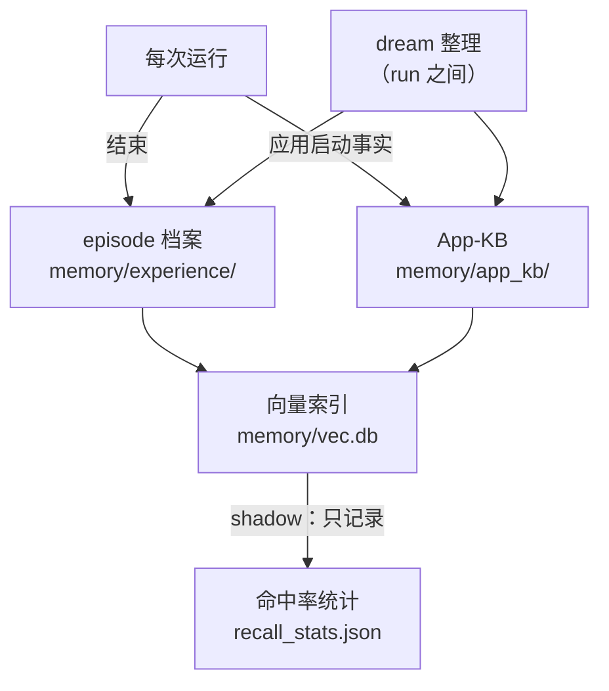
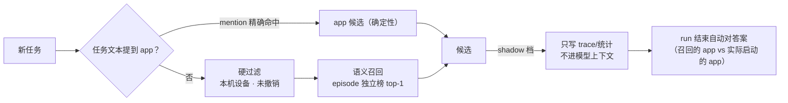

# 记忆

TaskWizard 的记忆分三层，全部本地存储，不依赖外部服务。默认根目录是 `memory/`，其中档案、lesson、
向量索引与 runner 运行目录可分别用 `PHONE_AGENT_EXPERIENCE_DIR`、`PHONE_AGENT_LESSONS_DIR`、
`PHONE_AGENT_VEC_DB`、`PHONE_AGENT_RUNS_DIR` 独立覆盖（见[配置参考](configuration.md)）。蒸馏、晋升、
受控注入与离线评估见[自进化](evolution.md)。

## 总览

## 第一层：App-KB（应用事实库） {#app-kb}

记录本机可启动应用及其别名，按设备序列号隔离。

写入路径：

| 来源 | 条件 | 信任序 |
|---|---|---|
| `device` | run 启动时同步本机应用清单 | 第二：同词条决胜时设备 scope 先于全局 `learned` |
| `learned` | 启动成功且叫法与官方名不同；或"中文叫法失败→候选包名成功"的隐式纠正 | 第三 |
| `user` | 用户明确纠正（`--learn-alias 名称=包名`） | 最高 |

同词条决胜时只有 `user` 能压过 `device`：名字解析给 `device` 条目 1.0、`learned` 0.9 的 kind 先验，权威序
同样是 `user` → `device` → `learned`。`--learn-alias` 与 `--forget-alias` 只写/删全局 `user` / `learned`
条目，dream 的别名纠正也只覆盖全局 `learned`，device 清单条目三者都不触碰。

管理入口：`--learn-alias "名称=包名"` 写入全局 `user` 别名（最高信任，包未安装时警告后仍保存，不做设备清单
同步）；`--forget-alias "名称"` 只删除该名称的全局 `user` / `learned` 条目，device 清单条目不动。两者的实际
变更都追加到 `memory/app_kb/events.jsonl`。

错误别名纠正：dream 在整理时识别"启动 A → 1-2 步内模型自述开错并退出 → 启动 B 成功"的签名，直接覆盖错误
learned 映射（仅保存命中的自述词，不落完整模型 note）；user 别名阻止自动覆盖。

淘汰与衰减：dream 只删除"已标记 stale 或超过 90 天未被使用，且 confidence < 0.5"的条目；`device` / `user`
条目的 confidence 恒为 1.0、`learned` 恒为 0.9，都到不了删除门槛。`--dream`（或 `PHONE_AGENT_DREAM=auto`）
做完整整理（含删除）；run 之间的 auto dream 只做合并与设备清单对账，一个条目都不删——装机清单里缺包时 device
条目只被标记 stale。

### 隐式别名契约 {#implicit-alias}

`PHONE_AGENT_IMPLICIT_ALIAS=on`（默认）时，`launch_app(name)` 的名字解析失败并不直接写记忆：失败回执里实际
出现的候选包名只作为 **run 内证据**暂留（随 run 结束丢弃，不跨 run 累积）。之后设备确认启动的包名与该证据精确
相等时，才把该叫法写成 `kind=learned` 别名（`scope=global`、`confidence=0.9`、`success_count=1`、带 evidence
note）。

启动成功但叫法与官方名不同时，另有一条同样写 `learned` 的路径：它要求设备清单（或静态 registry）给出该包的
canonical label、叫法与它不同，之后与隐式路径一样过敏感词表。

以下情况绝不写入：`PHONE_AGENT_APP_KB=off`、`PHONE_AGENT_IMPLICIT_ALIAS=off`、证据为空或与确认启动的包名
不匹配、叫法本身等于包名、叫法不是合法包名形态，以及命中敏感词表。同一 run 内同一条叫法只写一次（run 内去重），
跨 run 不设持久判重。

### 别名纠正契约 {#alias-correction}

`PHONE_AGENT_ALIAS_OVERWRITE=on`（默认）时，dream 按 run 分组识别纠正签名：成功启动 A → 1-2 步内成功 `back`
或成功启动另一个应用、且该步的 note 命中 `PHONE_AGENT_ALIAS_OVERWRITE_NOTES` 词表（默认 `开错,不对,不是,错了,wrong app`）
→ 随后成功启动 B。命中叫法名下的全局 learned 条目被删掉，写入唯一的新 learned 条目（delete-old / store-new），
并追加 `alias_overwritten` 事件（含旧包、新包、证据 run 与签名指纹）；该叫法名下没有 learned 条目时直接新写一条。
`kind=user` 的别名永不参与自动覆盖；同一签名指纹只处理一次。

App 名解析（启动时的名字→包名）：归一化 → 多路候选生成（精确/词汇/拼音/嵌入向量）→ 先验排序 → 证据分型三态
决策。设备事实类强证据（精确别名、产品名等于包名片段且唯一）才自动执行；拼音/模糊/嵌入弱证据只给排序候选由
模型选择；resolved 之后仍要过装机清单与 launch policy。详见[架构](architecture.md#app-name-resolution)。

存储为 JSONL 事件日志 + 可重建的 `kb.json` 视图。

## 第二层：episode 经验档案 {#experience-plane}

每次 run 结束写一条结构化档案（`memory/experience/`）：目标原文、成败与终局原因、步数、分角色 token、警告
次数、验收判决、涉及应用、时段/星期、能力快照；工具事件另存模型逐步自述的 intent/note。

- 固定 schema：字符串原文照存；schema 之外的字段（工具参数与回执、输入文本、mark 文本、截图、模型推理）直接
  丢弃，永不落盘；
- observe-only：记录不改变模型行为；写入路径全部 fail-open，档案写入失败不影响 run；
- 超量（默认 500 条）或超龄（默认 90 天）的档案由 dream 折叠为聚合统计。

### 档案契约 {#experience-schema}

每个正常收尾的 run 在结束钩子里恰好追加一条 `episode_outcome` 事件；工具回执追加固定 schema 的
`experience_event`。两者写入 `memory/experience/events.jsonl`（追加式真相），`episodes.json` 是可重建视图
——读取时发现缺失或损坏就从事件流重放重建并原子写回。事件名与字段定义见 `phone_agent/v2/experience.py`。

两类事件共用信封字段 `type` 与 `schema_v`：前者标明事件类型，后者标明 schema 代次，供读取方分辨记录形状。
`episode_outcome` 的其余字段：运行标识与时间（`run_id` / `ts_start` / `ts_end` / `time_of_day` / `day_of_week`）、
`device_scope`、`goal_text`、`apps`、`success` / `reason` / `steps`、token 计量（`tokens_total` / `tokens_by_role`）、
`warnings`、`takeover`、`verifier`、`capabilities` 能力快照、`injected_lessons` 与 `injected_procedures`（只记
lesson id）、`deliverable_path`。

校验而不转换：只做形状与类型校验，不派生新语义。

- 只有 `intent` / `note` 两个字段有长度上限（各 200 字），且会折叠为单行空白（连续空白压成一个空格）；其余
  文本原文照存；
- `injected_lessons` / `injected_procedures` 只接受 lesson id 形态的字符串，不落经验正文；
- `deliverable_path` 仅在本 run 成功写出交付物后非空；
- 档案视图除 episode 条目外还包含 `aggregate:<分类>` 聚合键，供 dream 归档后统计。

## 第三层：语义回想（RAG，默认 shadow） {#rag-recall}

- 嵌入模型：本地 MLX 运行 Qwen3-Embedding-0.6B（`PHONE_AGENT_EMBED_MODEL` 可换）；
- 索引：run 结束自动增量更新，质量闸门是 goal 非空且 `steps >= PHONE_AGENT_INDEX_MIN_STEPS`（默认 2），更短
  的档案只留档不进索引；`--rebuild-vec` 可全量重建；
- 别名嵌入文本含中文名（learned/user 别名 → 静态 registry → 包名）；纯包名条目只供精确匹配；
- 统计口径：Hit@1、污染率（contaminated run rate）、包级 P/R，控制台「记忆」页展示。统计固定写在 `<memory_dir>`
  下的 `experience/recall_stats.json`，不随 `PHONE_AGENT_EXPERIENCE_DIR` 移动；`on` 档注入的是 lesson 与
  过程卡，**不是**这里召回的 episode（召回结果无论哪个档位都不进 actor 上下文）。

三档（`PHONE_AGENT_MEMORY_RAG`）的完整边界、混合检索打分、投递复检、lesson 与过程卡的注入契约见
[自进化](evolution.md#lesson-injection)。
