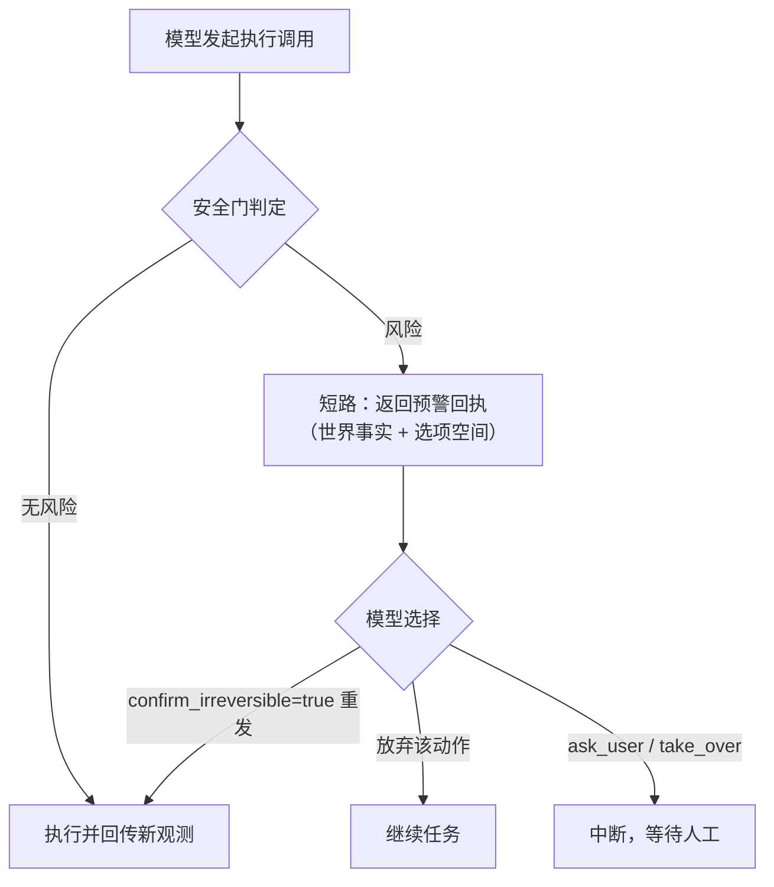

# 安全模式

`PHONE_AGENT_SAFETY_MODE` 控制执行类动作（tap / long_press / type_text / launch_app）的门控。

## 四档 {#safety-modes}

| 档位 | 行为 | 适用场景 |
|---|---|---|
| `wary`（默认） | 风险调用不执行、不中断：工具返回预警（世界事实 + 选项），模型带 `confirm_irreversible=true` 重发才执行 | 有人看管的日常使用 |
| `hard` | 风险调用中断，等待人工 approve / reject | 无人值守运行 |
| `reviewer` | wary + 第二模型对软候选做可逆性精排；精排故障时按预警处理 | 需要压低误报的场景 |
| `off` | 执行动作不门控 | 受控环境跑批 |

任何档位下，`ask_user` 与 `take_over` 都会中断并等待人工输入。

`wary` 的预警**不是人工付款门**：它只把世界事实与选项交回模型，不阻塞、不召唤人工、不新增模型决策；
真正需要人工的只有 `ask_user` / `take_over`，以及 `hard` 档的审批中断。`reviewer` 档的精排模型不可用
时按 fail-closed 处理（当作风险预警），不会静默放行。

## 风险判定 {#safety-classification}

安全门只覆盖四个执行工具：`tap` / `long_press` / `type_text` / `launch_app`。`scroll`、`swipe`、`back`、`home`、`wait` 与读屏类工具不参与判定。每个调用被判定为一个层级：`none`、`recall`（软候选）、`reviewer`（交由复核模型精排）、`hard`。`launch_app` 与 `type_text` 走各自的专属分支，其余工具的判定基于目标文本：

| 条件 | 层级 |
|---|---|
| 模型自申报 `sensitive=true`（或 `dangerous=true`；四个执行工具的公开 schema 只暴露 `sensitive`，该键当前没有公开路径可达） | `hard` |
| `type_text` 目标确为密码输入框（只看显式的 `target_mark_id`） | `hard` |
| `type_text` 内容命中凭据/验证码域（手机号/邮箱/订单号/密钥形态，或密码/验证码/登录/账户词表） | `hard` |
| `launch_app` 目标疑似支付/银行类敏感应用（词表含 bank / alipay / wallet / pay / 银行 / 支付宝 / 钱包 / 支付 / 转账等） | 软候选（可逆） |
| 承诺动词 + 不可逆对象共现（如“确认支付”“提交订单”“确认删除”；裸“删除”“支付方式”是软候选） | `hard` |
| 目标命中凭据/验证码敏感域（经 `tap`/`long_press` 目标） | `hard` |
| 其余命中策略词表的软候选 | 软候选 |

软候选与预警不是一回事：`wary` / `hard` 档**不**对软候选预警，只有 `hard` 信号升级；软候选只在 `reviewer` 档由复核模型精排。`launch_app` 的敏感应用命中只算软候选——启动应用可逆；例外是模型自申报 `sensitive=true`，它在 `launch_app` 专属分支之前就先升级为 `hard`。

## 预警文案 {#safety-warning}

预警回执（status 为 error）由世界事实与选项空间组成，形如：

```
⚠️ 已拦截（未执行）：tap → 「确认支付」
世界事实：该操作疑似『不可逆提交』（如支付/转账/下单/删除等确认动作）。
选项：
  1) 确认执行：带 confirm_irreversible=true 重新调用同一工具（其余参数不变）。
  2) 放弃：改做其它操作或重新观测。
  3) 交人工：调用 ask_user 询问，或 take_over 请求人工接管。
```

`confirm_irreversible` 参数存在于 `tap` / `long_press` / `type_text` / `launch_app` 四个执行工具上（`swipe` / `scroll` / `back` / `home` / `wait` 没有）。确认标记只在 `wary` / `reviewer` 的预警监听里先于分类检查：带 `confirm_irreversible=true` 重发的调用直接放行，不重新分类，因此自申报敏感 + 确认标记的组合也会执行。`hard` 档的审批中断直接分类、不读该标记，带确认重发仍会中断等待人工 approve / reject。预警目标文本的加工方式：`type_text` 与 `target_description` 先脱敏再截断（32 / 24 字），`launch_app` 目标只截断到 24 字；`wary` / `reviewer` 档拦截时 stdout 打一行非阻塞提示 `[safety] <tool>: <reason> — 已拦截，等待模型确认`。复核模型判为不可逆时，回执里的世界事实写「复核模型判定该操作『不可逆』」。

## 复核模型（reviewer 档） {#safety-reviewer}

`reviewer` 档只对软候选征询第二个模型：复核器只看工具名与被脱敏的目标文本摘要（最多 120 字），不读完整对话。判定可逆则放行，判为不可逆则按预警处理。本节的「复核模型 / 复核器」指这道安全精排；finish 两段式返回的「复核包」是另一件事——那是 `v2/review.py` 生成的世界镜像（见[finish 验收](#finish-verification)）。

- 复核模型的来源依次为 `PHONE_AGENT_SAFETY_REVIEWER_MODEL`、`models.json` 的 `roles.safety_reviewer.model`、`PHONE_AGENT_VERIFIER_MODEL`；三者皆空时不构建复核器，该档对软候选转为 fail-closed 预警（原因 `reviewer_unavailable_failclosed`），**不**回落到 actor 模型；
- 复核器构建先沿角色链试一跳回退（`safety_reviewer` 的下一跳是 `verifier` 或 actor 主模型）并记 `model_fallback` 审计；回退也失败才跳过精排并按预警处理；
- 精排调用异常记原因 `reviewer_error_failclosed` 并按预警处理；答复无法解析时同样按不可逆处理（fail-closed）；
- 精排调用作为 `reviewer` 角色计入同一份 token 用量台账，因此消耗 run 的 token 预算。

## 人工中断 {#human-interrupt}

`ask_user` 与 `take_over` 在任何档位都中断并等待人工输入，与安全门控相互独立。`hard` 档的审批中断经 `langgraph` 的 HITL 中断实现：审批通过则执行原调用，拒绝则返回 error 回执且不执行；被拒绝的 `take_over` 同样只回 error 回执，run 继续。自由文本答复只在 `allowed_decisions` 为 approve / reject 的中断（`hard` 审批与 `take_over`）里做映射：肯定词（`approve` / `yes` / `y` / `同意` / `确认` / `ok`）映射为批准，其余映射为拒绝；`ask_user` 的答复恒为 `respond`，原样交回模型，不走该映射。

## wary 流程 {#wary-flow}



## finish 验收 {#finish-verification}

与安全门控独立的两道完成检查（机制细节见[架构](architecture.md#finish-two-step)）：

1. **两段式 finish**：首次 `finish` 返回复核包（世界事实、路线状态、疑点、选项四节）；模型 `confirm=true` 再次调用才定稿。
   被接受的 finish 立即终局：同轮的后续 sibling 工具调用收到 error-status skipped 回执，且不再采样模型；<!-- allow:不再 -->
   首次复核、陈旧 confirm 与验收器拒绝在预算允许时仍可继续。被接受的 `take_over` 同样终局。
2. **独立验收器**（`PHONE_AGENT_FINISH_VERIFY`，默认 `auto`）：`auto` 档在高风险目标或硬矛盾时触发，`always`
   档每次 confirm 都触发，`off` 退化为单段落定。验收器只能看到目标、证据路线与尾部截图，看不到 actor 的
   完整对话；连续两次驳回转 `take_over`（终局原因 `finish 反复被验收驳回，需人工确认`）。验收器 setup/调用
   故障时放行（Verdict `approve=True`，**fail-open**）并把审计状态记为 `skipped`，未触发与 `off` 档的 run 同样
   记 `skipped`——**不等于**验收通过；验收答复无法解析时也按 APPROVE 放行（status `pass`）。

若 token 达到预算时已有有效复核包，系统最多保留一次模型真实确认机会，避免仅因预算跨线而无法
完成第二段。它绑定成功观测的屏幕序号及关闭的任务板、原始目标；这些事实变化后不能使用。模型仍可
不确认或请求人工介入，系统不代写 `confirm=true`。该额外响应中的普通工具操作不执行，重复 finish
不能续期；验收器拒绝后也不再获得额外模型轮次。确认仍经过原有证据、任务板、seq 与独立验收器检查；<!-- allow:不再 -->
人工中断、`MAX_STEPS` 和已经接受的终局保持优先。完整规则见[预算配置](configuration.md)。
普通工具一旦在复核后被委托执行，旧复核就不再有续办资格；这也覆盖命令可能已派发、结果未知且屏幕<!-- allow:不再 -->
序号尚未更新的错误。后续成功的新复核可重新证明当前状态，但仍不能刷新已经使用的一次续办额度。
