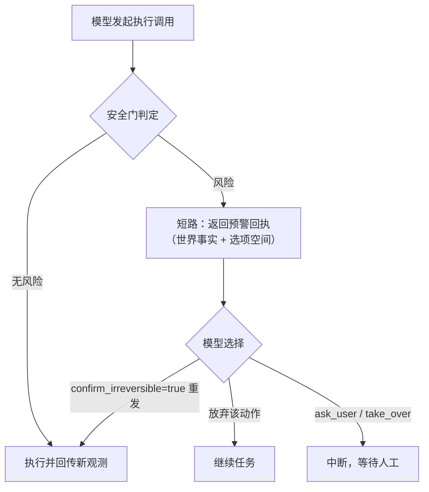

# 安全模式

`PHONE_AGENT_SAFETY_MODE` 控制执行类动作（tap / long_press / type_text / launch_app）的门控。

## 四档

| 档位 | 行为 | 适用场景 |
|---|---|---|
| `wary`（默认） | 风险调用不执行、不中断：工具返回预警（世界事实 + 选项），模型带 `confirm_irreversible=true` 重发才执行 | 有人看管的日常使用 |
| `hard` | 风险调用中断，等待人工 approve / reject | 无人值守运行 |
| `reviewer` | wary + 第二模型对软候选做可逆性精排；精排故障时按预警处理 | 需要压低误报的场景 |
| `off` | 执行动作不门控 | 受控环境跑批 |

任何档位下，`ask_user` 与 `take_over` 都会中断并等待人工输入。

`wary` 的预警**不是人工付款门**：它只把世界事实与选项交回模型，不阻塞、不召唤人工、不新增模型决策；
真正需要人工的只有 `ask_user` / `take_over`，以及 `hard` 档的审批中断。`reviewer` 档的精排模型不可用
时按 fail-closed 处理（当作风险预警），不会静默放行。

## 风险判定

满足以下任一条件即触发门控：承诺动词 + 不可逆对象（如"确认支付"）；密码/凭据/验证码输入；模型自声明 `sensitive=true`。可逆动作（如打开应用）不触发。

## wary 流程

## finish 验收

与安全门控独立的两道完成检查：

1. **两段式 finish**：首次 `finish` 返回复核包（目标、路线完成度、疑点）；模型 `confirm=true` 再次调用才定稿。
   被接受的 finish 立即终局：同轮的后续 sibling 工具调用收到 error-status skipped 回执，且不再采样模型；
   首次复核、陈旧 confirm 与验收器拒绝在预算允许时仍可继续。被接受的 `take_over` 同样终局。
2. **独立验收器**（`PHONE_AGENT_FINISH_VERIFY`，默认 `auto`，`off` 退化为单段落定）：`auto` 档在高风险
   目标或硬矛盾时触发——验收器只能看到目标、证据路线与尾部截图，看不到 actor 的完整对话；验收器
   setup/调用故障时放行（**fail-open**），但审计状态明确记为 `skipped`，**不等于**验收通过。

若 token 达到预算时已有有效复核包，系统最多保留一次模型真实确认机会，避免仅因预算跨线而无法
完成第二段。它绑定成功观测的屏幕序号及关闭的任务板、原始目标；这些事实变化后不能使用。模型仍可
不确认或请求人工介入，系统不代写 `confirm=true`。该额外响应中的普通工具操作不执行，重复 finish
不能续期；验收器拒绝后也不再获得额外模型轮次。确认仍经过原有证据、任务板、seq 与独立验收器检查；
人工中断、`MAX_STEPS` 和已经接受的终局保持优先。完整规则见[预算配置](configuration.md#预算与上下文压缩)。
普通工具一旦在复核后被委托执行，旧复核就不再有续办资格；这也覆盖命令可能已派发、结果未知且屏幕
序号尚未更新的错误。后续成功的新复核可重新证明当前状态，但仍不能刷新已经使用的一次续办额度。
